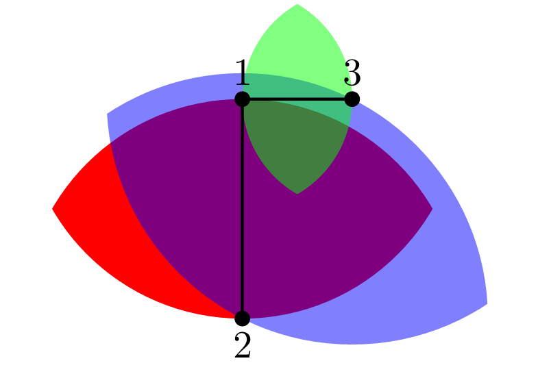
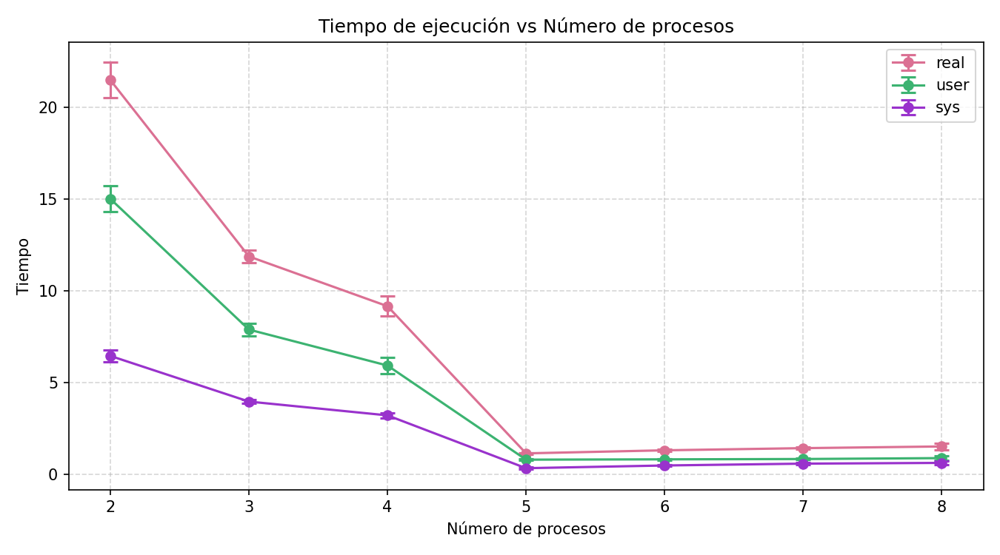

# Construcción Paralela de Grafos de Vecindad Relativa (RNG)

Implementación paralela del algoritmo de Grafo de Vecindad Relativa sobre puntos en una esfera unitaria, usando MPI e instancias de AWS. La fase de detección de aristas — el cuello de botella computacional — se distribuye entre procesos trabajadores siguiendo el algoritmo del barbero.

---
## Autor
Roxana Pérez Medina

roxanaperezmedina6@gmail.com

---

## Grafo de Vecindad Relativa

Dado un conjunto de puntos, existe una arista entre dos vértices $u$ y $v$ si y solo si ningún otro punto $w$ está más cerca de **ambos** $u$ y $v$ de lo que ellos están entre sí. Formalmente:

$$
(u, v) \in RNG \iff \nexists\, w : d(u,w) < d(u,v) \;\wedge\; d(v,w) < d(u,v)
$$

En esta implementación, los puntos se distribuyen sobre la superficie de una esfera unitaria y las distancias se calculan usando la distancia esférica:

$$
d(a, b) = \arccos\!\bigl(\sin\phi_a\sin\phi_b\cos(\theta_a-\theta_b) + \cos\phi_a\cos\phi_b\bigr)
$$

La complejidad de la verificación por fuerza bruta de todos los pares contra todos los testigos es $O(N^3)$, lo que hace indispensable la paralelización para valores grandes de $N$.


<p align="center">
  
</p>

---

## Estrategia de Paralelización: Barbero

El trabajo se distribuye usando el algoritmo del barbero:

- **Maestro:** mantiene una cola con todos los $\binom{N}{2}$ pares candidatos $(i,j)$ y los reparte uno a uno a los trabajadores disponibles. Recolecta los resultados y registra las aristas confirmadas.
- **Trabajadores:** solicitan repetidamente un par al maestro, realizan la verificación de testigos para ese par y devuelven el resultado. Los trabajadores duermen cuando no hay trabajo disponible.

---

## Salida

Los resultados se almacenan en `results/<N>_nodes_data.txt` con las siguientes secciones:

```
points
<id> <phi> <theta>

edges
<matriz de adyacencia NxN>

distances
<i> <j> <distancia_esférica>

nodes_degrees
<id> <grado>

```

Los benchmarks (tiempo real, usuario y sistema, y porcentaje de uso de CPU) se imprimen en stdout.

---

## Detalles de Implementación

### Generación de Puntos

Los puntos se generan pseudoaleatoriamente sobre la esfera unitaria con distribución uniforme:

```c
phi   = arccos(1 - 2u),  
theta = 2π v,            
```

### Matriz de Distancias

Cada proceso precalcula de forma independiente la matriz simétrica completa $N \times N$ de distancias antes de iniciar la fase paralela. Esto evita comunicación redundante entre procesos durante la verificación de aristas.

### Indexación de Pares

El maestro mapea un índice lineal $p \in [0, \binom{N}{2})$ al par $(i, j)$, permitiendo despachar pares en $O(1)$ sin almacenar la lista completa.

### Formato del Mensaje

Cada mensaje MPI transporta un struct de tamaño fijo (`MPI_myvar`) que contiene:

- `N` — número de puntos
- `i`, `j` — índices del par (o valores centinela `-2` para señalizar apagado)
- `is_edge` — bandera de resultado
- `points[]` — arreglo con las coordenadas de todos los puntos (enviado en el primer contacto)

El apagado se señaliza cuando el maestro envía `i = j = -2`.

---


## Resultados: Tiempo de Ejecución vs. Número de Procesos

La siguiente gráfica muestra el tiempo de ejecución en función del número de procesos MPI utilizados, medido con 500 puntos sobre la esfera unitaria.

<p align="center">
  
</p>


## Licencia

GNU General Public License
